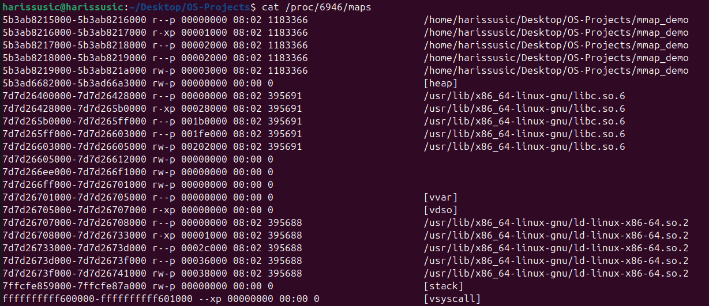
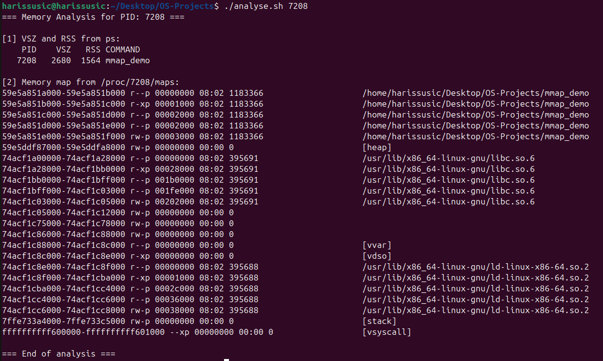

# Project 2: Memory Management

**Team Members:**
- Sanin Zajmovic - 23004476
- Haris Susic - 23004218


---

## Task 2.1 - mmap() & munmap() System Calls

In this project, we used the `mmap()` and `munmap()` system calls to dynamically allocate and deallocate memory in a Linux process.

```c
void *addr = mmap(NULL, 4096, PROT_READ | PROT_WRITE, MAP_PRIVATE | MAP_ANONYMOUS, -1, 0);
```

### Explanation of mmap() arguments:
- `NULL`: Let the OS choose the address
- `4096`: Standard practice for OS, allocates one page (size is 4KB)
- `PROT_READ | PROT_WRITE`: Allows reading & writing
- `MAP_RIVATE | MAP_ANONYMOUS`: Create a private anonymous mapping (not backed by a file)
- `-1, 0` : Required when `MAP_ANONYMOUS` is used

To release the memory, we used:
```
munmap(addr, 4096);
```

This returns the page to the OS (Operating System).

---

## Task 2.2 - Implementation of C Program (`mmap_demo.c`)

We implemented a C program that:
- Printed initial memory usage using `ps`
- Allocated 4KB of memory using `mmap()`
- Printed memory usage after `mmap()`
- Wrote into the allocated memory (`strcpy((char *)addr, ...)`)
- Printed memory usage after writing
- Unmapped the memory using `munmap()`

All steps included error checking and appropriate inline comments for explanation.
The program compiles without ANY warnings OR errors.

---

## Task 2.3 - Memory Usage Analysis

We measured memory usage at three key stages using the command:
`ps -o pid,vsz,rss,comm -p <PID>`

### Screenshot 1 - VSZ/RSS 

<table>
  <tr>
    <td></td>
  </tr>
</table>


This screenshot shows memory usage at three different phases:
- before mmap
- after mmap
- after writing to memory


We also examined memory mappings with:
`cat /proc/<PID>/maps`

### Screenshot 2 - /proc/PID/maps

<table>
  <tr>
    <td></td>
  </tr>
</table>


This screenshot shows the memory layout of the process while mmap'd memory is STILL Active, including [heap], [stack], and the anonymous mapped memory region used by `mmap()`.

---

## Task 2.4 - Explanation of Observations

### a. VSZ/RSS Values (at each stage):
| Phase                      | PID  | VSZ (KB) | RSS (KB) |
|----------------------------|------|----------|----------|
| Before mmap                | 6833 | 2680     | 1560     |
| After mmap                 | 6833 | 2684     | 1560     |
| After writing to memory    | 6833 | 2684     | 1560     |


### b. Memory Layout (/proc/PID/maps)

The memory map of the process shows the typical memory segment such as:

- `[heap]`: dynamically allocated memory (e.g., malloc, mmap)
- `[stack]`: function call stack
- `[vvar]`, `[vdso]`, `[vsyscall]`: kernel-related mappings
- Several entries with `rw-p` and no file path → these are **anonymous mappings** (likely from our `mmap()` call)

The screenshot below shows the complete memory layout of the process while the `mmap()` region was still active:

<table>
  <tr>
    <td></td>
  </tr>
</table>


### c. Observations & Explanation

After executing the program, we observed the following:

- The **VSZ (virtual memory size)** increased from 2680 KB to 2684 KB after calling `mmap()`. This indicates that a 
  new memory page (4KB) was successfully reserved in the virtual address space.
- The **RSS (resident set size)**, which reflects the amount of actual physical memory used, remained constant at 1560 KB. 
  This confirms that **lazy allocation** is in effect — the kernel does not assign real physical memory until the memory is accessed.
- Even after writing to the memory, the RSS did not change visibly. This can happen because:
  - The change (one page) is too small to reflect in rounded RSS output,
  - Or the system had already committed that memory due to optimizations.
- The `/proc/<PID>/maps` output shows a new **anonymous memory segment** created, 
  which is consistent with the behavior of `mmap()` with `MAP_ANONYMOUS` and `MAP_PRIVATE` flags.

This behavior illustrates how Linux efficiently manages memory, by delaying physical allocation until 
absolutely necessary (page fault), thus conserving resources. 


## Task 2.5 - Shell Script : `analyse.sh` 

We created a shell script `analyse.sh` which automates the analysis of memory usage for a specific process.

### Script Functionality
- Accepts a process ID (PID) as a command-line argument
- Verifies that the process exists
- Displays memory usage using the `ps` command (VSZ and RSS)
- Displays the memory map using `/proc/<PID>/maps`
- Includes inline comments to explain each step
- Was made executable using `chmod +x analyse.sh`

### Execution Example
The script was successfully tested while the `mmap_demo` process was running.

Below is a screenshot showing the output of the script:

<table>
  <tr>
    <td></td>
  </tr>
</table>


