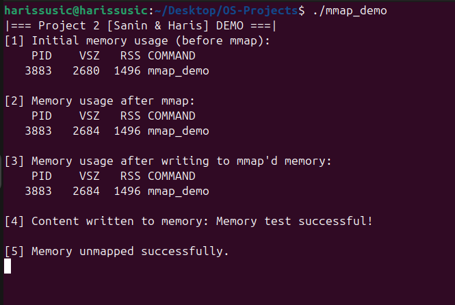
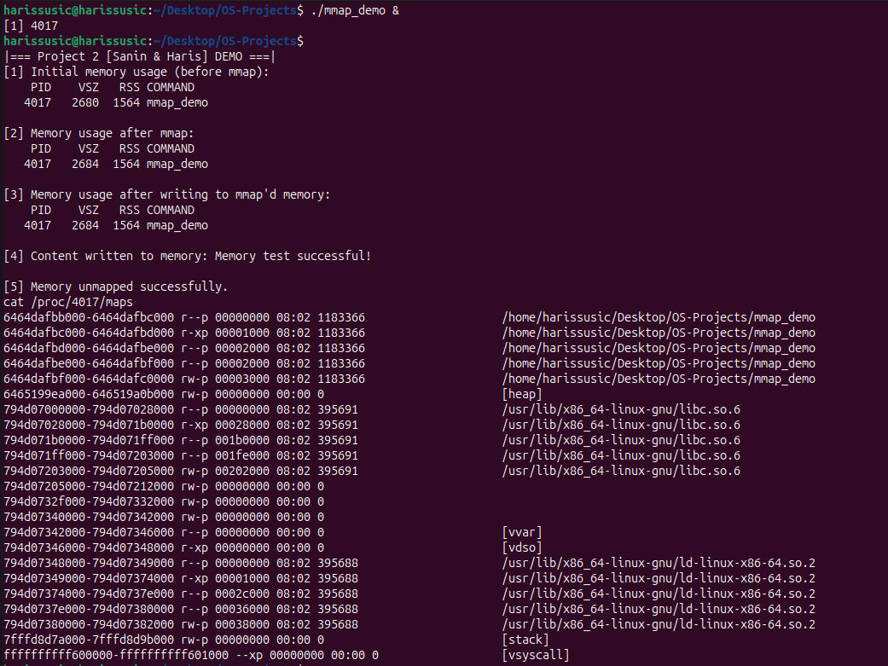

# Project 2: Memory Management

**Team Members:**
- Haris Susic - 23004218
- Sanin Zajmovic - 23004476


---

## Task 2.1 - mmap() & munmap() System Calls

In this project, we used the `mmap()` and `munmap()` system calls to dynamically allocate and deallocate memory in a Linux process.

```c
void *addr = mmap(NULL, 4096, PROT_READ | PROT_WRITE, MAP_PRIVATE | MAP_ANONYMOUS, -1, 0);
```

### Explanation of mmap() arguments:
- `NULL`: Let the OS choose the address
- `4096`: Standard practice for OS, allocates one page (size is 4KB)
- `PROT_READ | PROT_WRITE`: Allows reading & writing
- `MAP_RIVATE | MAP_ANONYMOUS`: Create a private anonymous mapping (not backed by a file)
- `-1, 0` : Required when `MAP_ANONYMOUS` is used

To release the memory, we used:
```
munmap(addr, 4096);
```

This returns the page to the OS (Operating System).

---

## Task 2.2 - Implementation of C Program (`mmap_demo.c`)

We implemented a C program that:
- Printed initial memory usage using `ps`
- Allocated 4KB of memory using `mmap()`
- Printed memory usage after `mmap()`
- Wrote into the allocated memory (`strcpy((char *)addr, ...)`)
- Printed memory usage after writing
- Unmapped the memory using `munmap()`

All steps included error checking and appropriate inline comments for explanation.
The program compiles without ANY warnings OR errors.

---

## Task 2.3 - Memory Usage Analysis

We measured memory usage at three key stages using the command:
`ps -o pid,vsz,rss,comm -p <PID>`

### Screenshot 1 - VSZ/RSS 

<table>
  <tr>
    <td></td>
  </tr>
</table>


This screenshot shows memory usage at three different phases:
- before mmap
- after mmap
- after writing to memory


We also examined memory mappings with:
`cat /proc/<PID>/maps`

### Screenshot 2 - /proc/<PID>/maps

<table>
  <tr>
    <td></td>
  </tr>
</table>


This screenshot shows the memory layout of the process while mmap'd memory is STILL Active, including [heap], [stack], and the anonymous mapped memory region used by `mmap()`.

---

## Task 2.4 - Explanation of Observations

### a. VSZ/RSS Values (at each stage):
| Phase                      | PID  | VSZ (KB) | RSS (KB) |
|----------------------------|------|----------|----------|
| Before mmap                | 6833 | 2680     | 1560     |
| After mmap                 | 6833 | 2684     | 1560     |
| After writing to memory    | 6833 | 2684     | 1560     |


### b. Memory Map Analysis:


### c. Explanation: 
